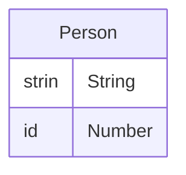

# HNGX-STAGE2
RESTFUL-API FOR Person Resource
To set up this endpoint visit the url: link of the host point

## HTTP VERB AND ACTION
The api have 5 endpoint which in totality perform CRUD on the person resource

**GET** - url/api
  - This  give you all the resource from the database
    
**GET** - url/api/**1**
  - The parameter 1 can be change to any as it a id to access a particular person from the database.
    
**POST** - url/api?name=**Matrix**
  - The query string matrix in this instance can be change to any  name and this endpoint is use to create a new person resource.
    
**DELETE** - url/api/**1**
  - The parameter 1 in this instance can be change,  the route delete any person with that id.

# Person Entity Diagram

